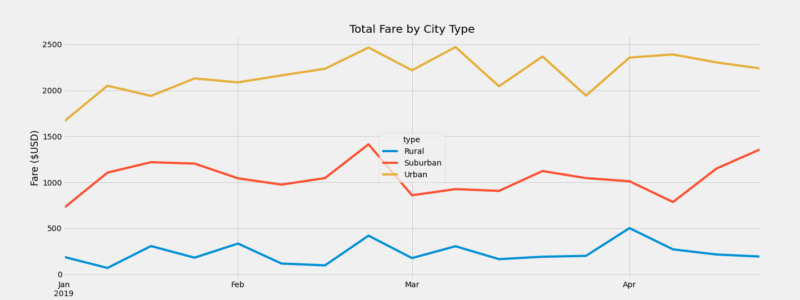

# PyBer_Analysis
This analysis was to show on high level the total number of PyBer rides, total number of drivers, a sum of all the fares, and average of fares.

# Results
As a result, urban cities tend to be in higher demand for PyBer Rides than suburban and rural cities. Between the months of January and April, urban cities collect about $1500 to $2500 in fares. Meanwhile suburban cities collect between $500 to $1500 but are still higher than the rural areas.

# Summary
I would recommend to provide more incentives for rural and suburban city drivers to get out their more and get more rides.
Urban cities would need more drivers.
